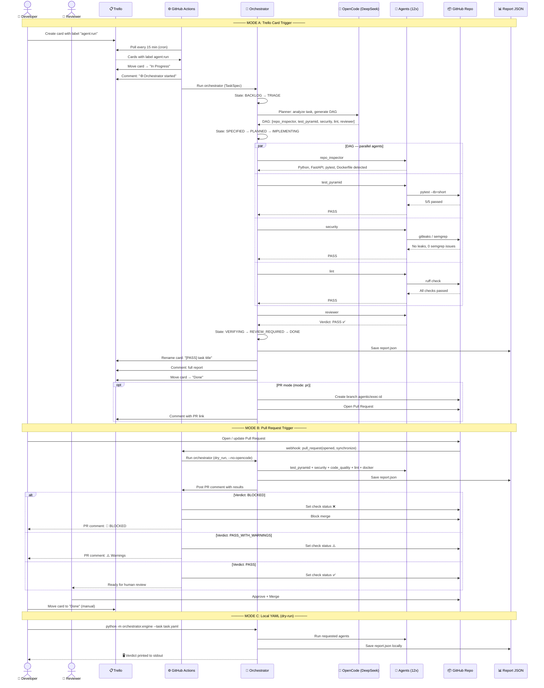
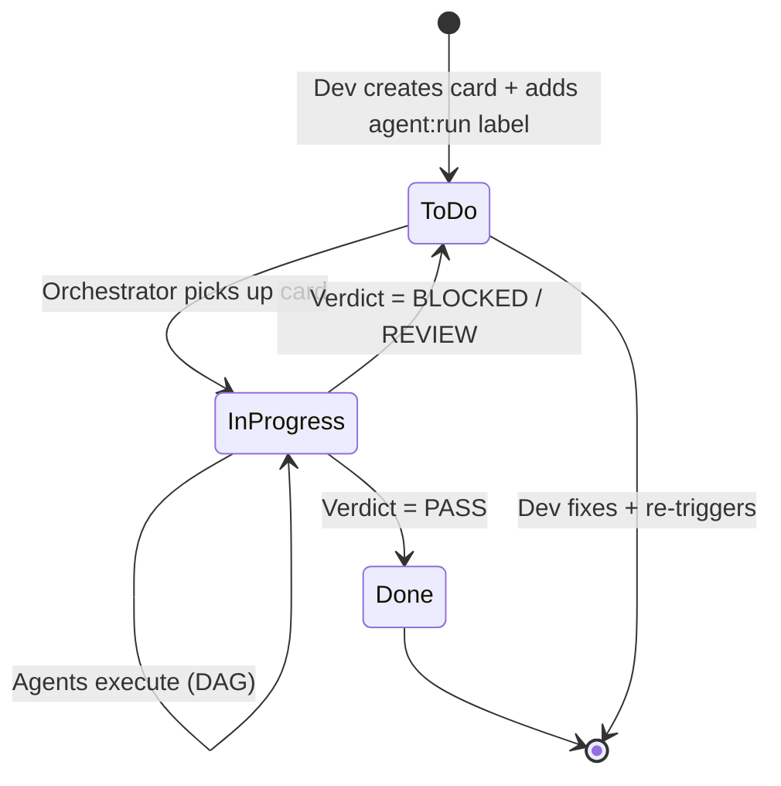
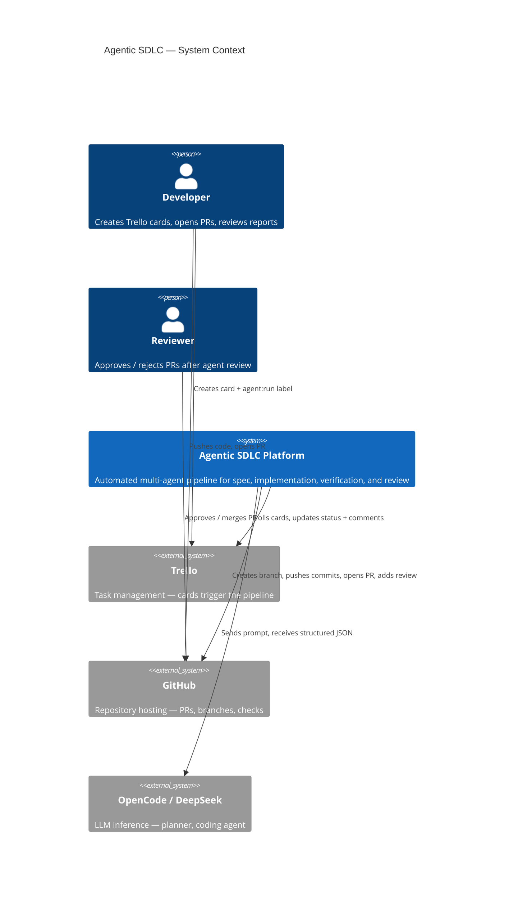
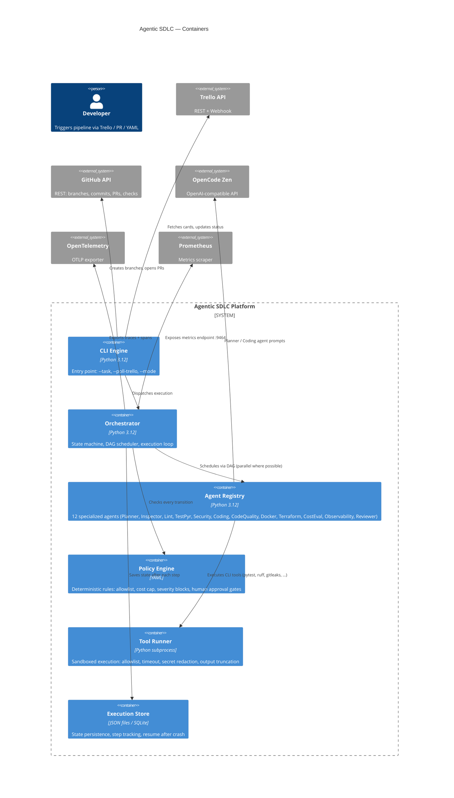

# Agentic SDLC Platform

**Bead: B-001-000 | Version: 0.1.0 | Status: MVP (M0–M8)**

Automated, policy-guarded software delivery pipeline: a Trello card (or local
YAML task) triggers a DAG of specialized agents that plan, inspect, implement,
verify, and review changes on a repository — producing a structured report and,
optionally, a Pull Request. Every risky action requires human approval.

## 1. Obiettivo

Trasformare una card Trello formattata secondo la metodologia VSDD in un flusso
SDLC automatizzato ma controllato: tracciabilità totale (execution_id), policy
deterministica, zero esecuzioni arbitrarie, sicurezza by-default.

## 2. Sequence Diagram — Development Workflow



### Card lifecycle on Trello



## 3. C4 Model — Component Level

### 4.1 System Context (Level 1)



### 4.2 Container Diagram (Level 2)



### 4.3 Component Responsibilities

| Component | Responsibility | Key Files |
|-----------|---------------|-----------|
| **CLI Engine** | Parse args, load env, dispatch to orchestrator or Trello polling | `orchestrator/engine.py` |
| **Orchestrator** | State machine (10 states), DAG scheduling, parallel agent dispatch, metric recording | `orchestrator/engine.py`, `state_machine.py`, `dag_scheduler.py` |
| **Policy Engine** | YAML-driven rules: allowlist, max cost, max steps, severity blocking, human approval gates | `orchestrator/policy_engine.py`, `policies/default.yaml` |
| **Tool Runner** | Subprocess sandbox: allowlist enforcement, timeout, stderr/stdout separation, secret redaction via regex, output truncation at 512KB | `runners/tool_runner.py` |
| **Execution Store** | Persist state as JSON per execution_id, resume after crash, step history | `orchestrator/execution_context.py` |
| **Planner Agent** | LLM-based task analysis, DAG generation, fallback planner when no LLM available | `agents/planner.py` |
| **Repo Inspector** | Detect language, build system, test framework, Docker/Terraform presence, file count | `agents/repo_inspector.py` |
| **Lint Agent** | `ruff check` (default), `ruff check --fix` (if authorized), never auto-formats without explicit flag | `agents/lint.py` |
| **Test Pyramid** | `pytest` runner, detect passed/failed counts, coverage support | `agents/test_pyramid.py` |
| **Security Agent** | `gitleaks detect` + `semgrep --config auto`, graceful fallback if tools not installed | `agents/security.py` |
| **Coding Agent** | LLM-generated diffs, path safety guard (blocks `.env`, `secret`, `credential`, path traversal), no merge | `agents/coding.py` |
| **Code Quality** | `mypy` type checking, file size analysis, complexity heuristics | `agents/code_quality.py` |
| **Docker Agent** | Static analysis: root user detection, version pinning, HEALTHCHECK, secret in ENV/ARG | `agents/docker.py` |
| **Terraform Agent** | `fmt -check`, `validate`, sensitive resource detection (IAM, DB, networking), no-apply enforcement | `agents/terraform.py` |
| **Cost Eval** | Heuristic AWS cost estimation, confidence levels, never invents prices | `agents/cost_eval.py` |
| **Observability** | Health/readiness/metrics/tracing/logging detection, suggestion-only, never blocking | `agents/observability.py` |
| **Reviewer** | Aggregate all findings, produce verdict (PASS / PASS* / BLOCKED / REVIEW), generate structured report | `agents/reviewer.py` |
| **Trello Adapter** | REST API, webhook HMAC-SHA1 verification, card→TaskSpec conversion, idempotent updates | `integrations/trello_adapter.py`, `trello_webhook.py` |
| **GitHub Adapter** | REST API: branch, commit, PR, comment, existing PR detection, dry-run mode | `integrations/github_adapter.py` |
| **OpenCode Adapter** | OpenAI-compatible HTTP client, JSON schema validation, retry with backoff (validation errors never retried) | `integrations/opencode_adapter.py` |
| **Observability** | OpenTelemetry traces + spans, 9 Prometheus metrics, configurable OTLP endpoint | `observability/tracing.py`, `metrics.py` |

```
 Trello card ──webhook/poll──┐
 Task YAML / PR event ──────▶│
                             ▼
                      ┌─────────────┐     ┌───────────────┐
                      │ Orchestrator│────▶│ Policy Engine │ (YAML, deterministico)
                      │ state mach. │     └───────────────┘
                      │ + DAG sched.│
                      └──────┬──────┘
                             │ parallel agents (semaphore)
        ┌──────────┬─────────┼──────────┬───────────┬───────────┐
        ▼          ▼         ▼          ▼           ▼           ▼
     Planner   Inspector   Lint      TestPyr    Security    Reviewer
     (LLM)     (scan)    (ruff)     (pytest)  (gitleaks/   (verdict)
                                               semgrep)        │
        │          │         │          │           │          ▼
        ▼          ▼         ▼          ▼           ▼      Report JSON
   OpenCode    ToolRunner (allowlist, timeout, secret redaction) ──▶ PR + Trello
   Adapter
```

## 4. Prerequisiti

- Python 3.12+
- Docker + Docker Compose (opzionale, per esecuzione containerizzata)
- Tool CLI opzionali: `ruff`, `pytest`, `gitleaks`, `semgrep`, `hadolint`,
  `terraform` (fallback controllato se assenti)

## 5. Setup locale

```bash
cd agentic-sdlc
python3.12 -m venv .venv && source .venv/bin/activate
pip install -e ".[dev]"
```

## 6. Configurazione environment

```bash
cp .env.example .env
# edit .env — nessun segreto va committato
```

Variabili: `OPENCODE_*` (LLM), `TRELLO_*` (cards + webhook), `GITHUB_*`,
`OTEL_EXPORTER_OTLP_ENDPOINT`, `PROMETHEUS_PORT`, `DRY_RUN`, `ALLOW_NETWORK`,
`ALLOW_TERRAFORM_APPLY`.

## 7. Avvio con Docker Compose

```bash
docker compose up --build sdlc          # esecuzione singola (dry-run demo)
docker compose --profile test up sdlc-test   # suite di test nel container
```

## 8. Avvio in dry-run

```bash
python -m orchestrator.engine \
  --task examples/local-task.yaml \
  --mode dry_run --no-opencode
```

Dry-run non tocca Trello, non crea branch/PR, non esegue comandi distruttivi.

## 9. Esecuzione con task YAML

```yaml
# examples/local-task.yaml
execution_id: local-demo-001
title: Add health endpoint
repository_path: ./examples/sample-service
requested_agents: [repo_inspector, test_pyramid, security, lint]
mode: dry_run
```

Report in `data/executions/<execution_id>/report.json`.

## 10. Configurazione Trello

- Modalità **webhook** (preferita): esponi `integrations/trello_webhook.py`
  (FastAPI) e registra il callback su Trello con `TRELLO_WEBHOOK_SECRET` +
  `TRELLO_WEBHOOK_CALLBACK_URL`. La firma HMAC-SHA1 è verificata.
- Modalità **polling** (fallback): `poll_trello(...)` con intervallo
  configurabile.
- Card attivata dalla label configurabile `TRELLO_RUN_LABEL_ID`.
- Sezioni riconosciute nella descrizione: `## Acceptance Criteria`, `## Agents`.

## 11. Configurazione GitHub

Token con permessi minimi (`contents:write`, `pull_requests:write`,
`issues:write` sul solo repo target). In `DRY_RUN=true` l'adapter non chiama
l'API. Adattatore no-op: `DryRunGitHubAdapter`.

## 12. Configurazione OpenCode

Endpoint OpenAI-compatible:

```env
OPENCODE_BASE_URL=https://opencode.ai/zen/v1
OPENCODE_API_KEY=<secret>
OPENCODE_MODEL=deepseek-v4-flash-free
```

Il modello non è hardcodato; output validato con JSON Schema; output non
conforme rifiutato; retry con backoff solo per errori trasienti (mai per
errori di validazione).

## 13. Gestione dei secret

- Solo env vars / GitHub Secrets — mai in codice, mai nei log.
- ToolRunner redaziona pattern di secret su stdout/stderr.
- CodingAgent rifiuta path che contengono `.env`, `secret`, `credential`.
- Firma webhook Trello verificata (HMAC-SHA1).

## 14. Esempio end-to-end

```bash
# 1. avvia il sample service target
python -m orchestrator.engine --task examples/local-task.yaml --mode dry_run --no-opencode
# 2. leggi il report
cat data/executions/local-demo-001/report.json
```

Verdict atteso: `PASS`, `PASS_WITH_WARNINGS`, `BLOCKED` o
`REQUIRES_HUMAN_APPROVAL`.

## 15. Troubleshooting

| Problema | Causa | Soluzione |
|----------|-------|-----------|
| `tool_blocked` | comando fuori allowlist | aggiungi a `policies/default.yaml` |
| `No such file or directory: gitleaks` | tool non installato | comportamento atteso: fallback controllato |
| verdict `REQUIRES_HUMAN_APPROVAL` | uno o più agenti falliti | leggi `findings` nel report |
| stato `BACKLOG` nel report | bug noto MVP: stato persistito da ultima scrittura | fixed via `update_state(..., ctx=ctx)` |

## 16. Limiti noti

- Nessun webhook Trello gestito in HA (singolo receiver).
- Cost Evaluation usa euristica statica, non Infracost live.
- Coverage test non aggregata cross-linguaggio.
- Nessun merge automatico (by design).

## 17. Roadmap

1. CodingAgent con apply su branch GitHub reale (PR mode).
2. Infracost integration per CostEvalAgent.
3. ReviewerAgent LLM-assisted con acceptance-criteria matching semantico.
4. Web UI per approval flow.
5. Supporto multi-repo per execution.

## 18. Threat model sintetico

Vedi [SECURITY.md](SECURITY.md): prompt injection, command injection, secret
leakage, terraform apply accidentale, esecuzioni duplicate, esfiltrazione OTLP.

## 19. Comandi Makefile

| Comando | Scopo |
|---------|-------|
| `make install` | Installa dipendenze + dev |
| `make test` / `test-integration` / `test-all` | Suite di test |
| `make lint` / `format` / `typecheck` | Quality gate |
| `make run` | Dry-run con task di esempio |
| `make build` | Build immagine Docker |
| `make clean` | Pulizia artefatti |
