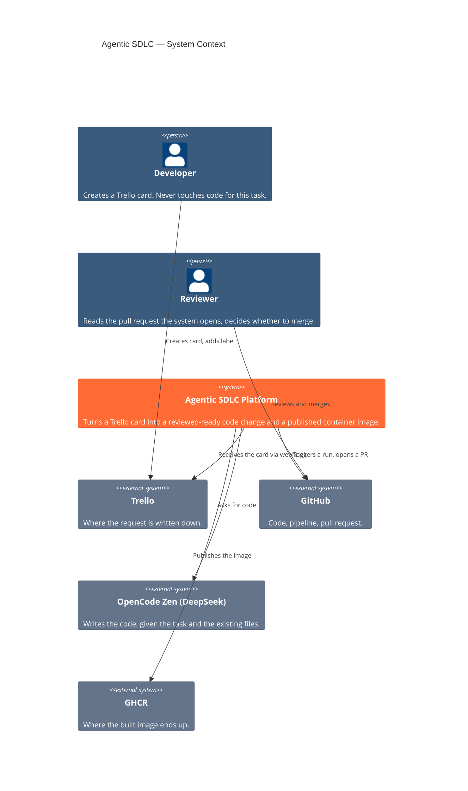
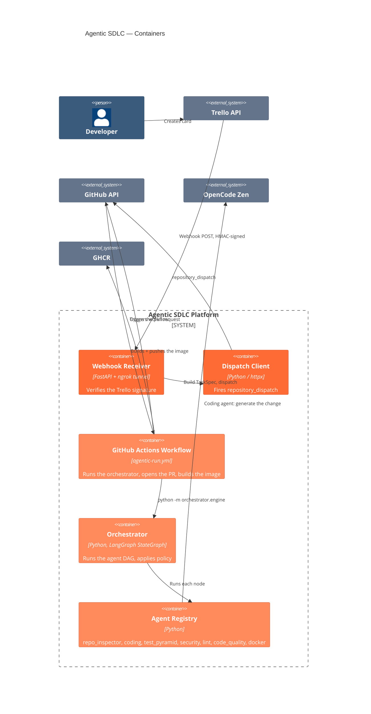
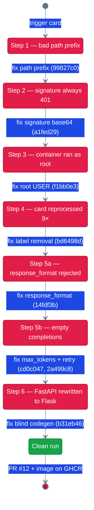
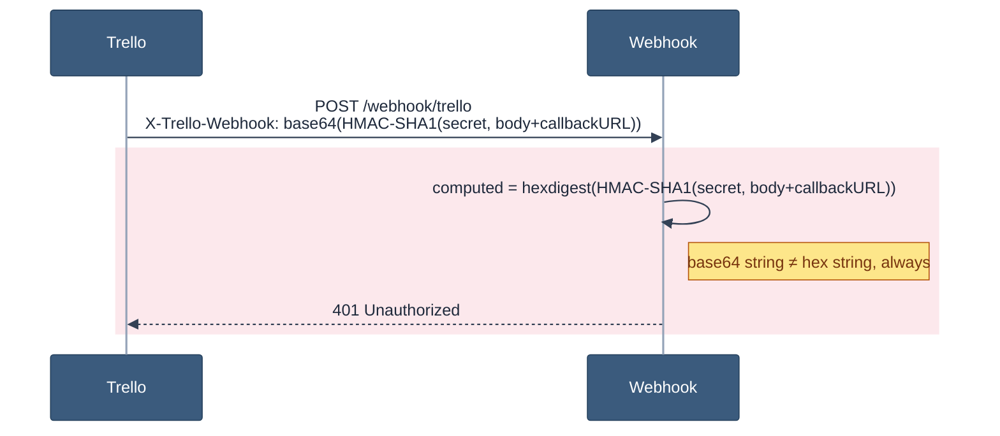
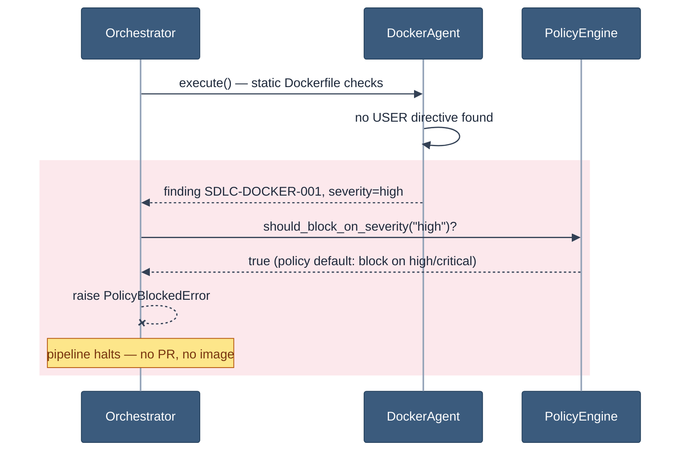
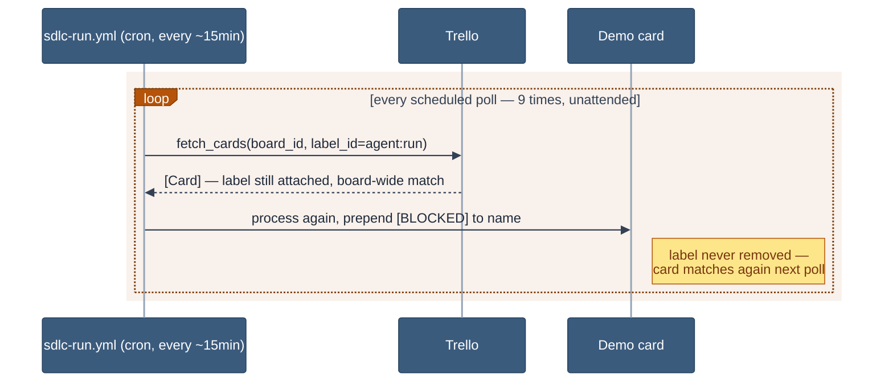
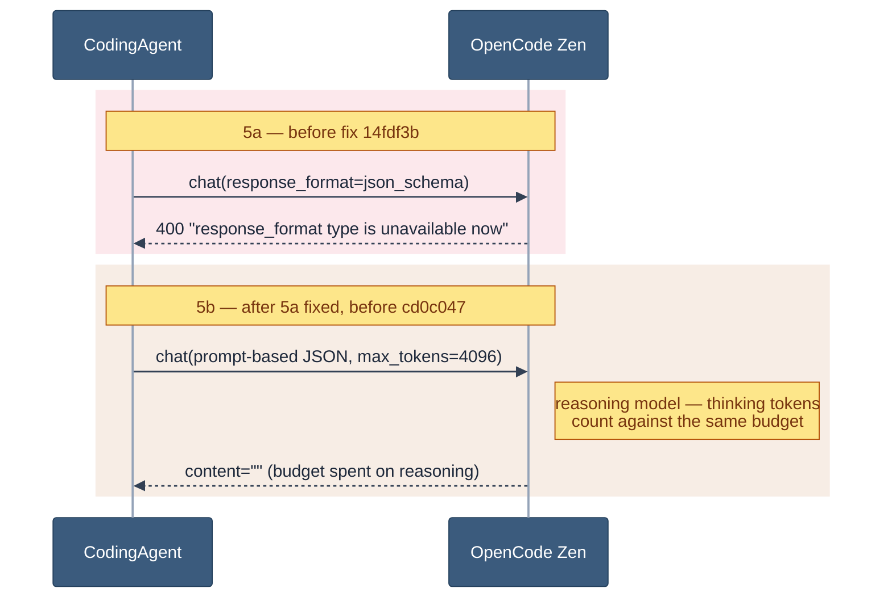
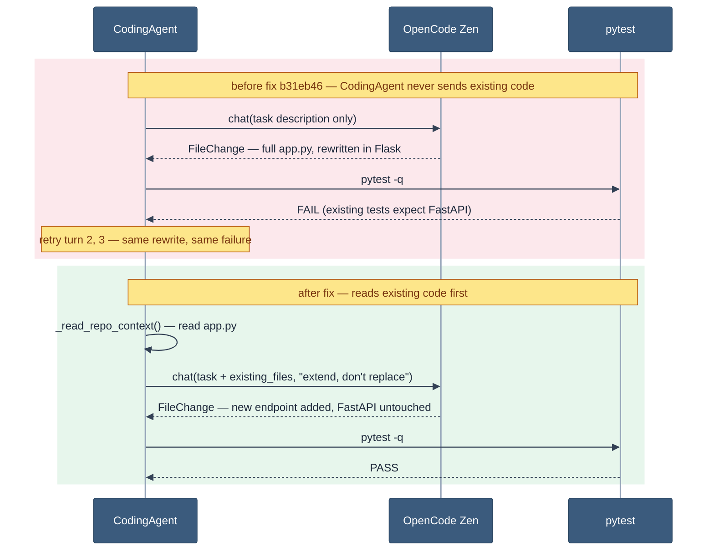
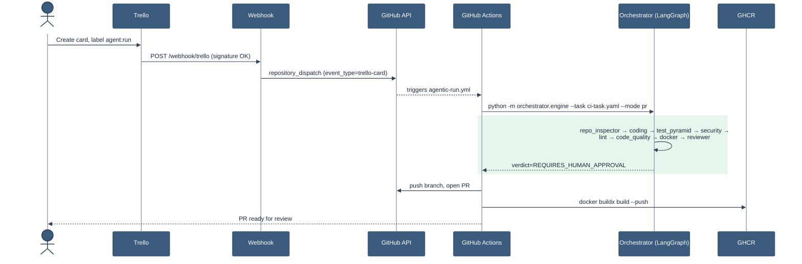

# The Burning Ship Run — a real Trello card, a real AI pipeline, six real bugs

**Visual version:** https://claude.ai/code/artifact/99a5f5de-206d-4cc7-93f1-48c32f7f9f38
**Date:** 2026-08-11 → 2026-08-12
**Trigger:** one Trello card, created by a human, never touched again except to add a label
**Result:** [PR #12](https://github.com/lorenzogirardi/agentic-sdlc/pull/12) merged-ready, Docker image live on GHCR
**Full run:** https://github.com/lorenzogirardi/agentic-sdlc/actions/runs/31575555378

---

## How to read this document

1. **TL;DR** — the 60-second version
2. **Architecture** — what the system is made of (C4 Context + Container)
3. **The journey** — one diagram showing all six failed attempts and what fixed each
4. **Six bugs, step by step** — each one: what broke, the mechanism (diagram), the fix, the commit
5. **The clean run** — full sequence diagram, end to end, once everything worked
6. **Why this is the story worth telling**

---

## 1. TL;DR

We asked one question: *if a developer only ever creates a Trello card, can a
team of AI agents take it all the way to a reviewable pull request and a
published Docker image — with no human writing a line of code, wiring a
webhook, or babysitting a build?*

We ran it for real, against a live Trello board and a live GitHub repo, not a
simulation. It found **six real bugs in our own automation** on the way —
a webhook signature check that could never have worked, a container that
silently ran as root, an infinite retry loop quietly burning API credits, and
an AI coding agent that rewrote a working app in the wrong framework because
nobody had shown it the app it was supposed to be extending. We fixed every
one of them live, using the same agents' own findings to know where to look,
and re-ran the exact same card until it worked cleanly.

That's the real story: not a demo that worked on the first try, but a system
whose safety checks caught its own mistakes — and ours — before anything
shipped broken.

---

## 2. Architecture

### Context — who talks to this system


<sub>Blue = human actors · orange = the platform · grey = third-party systems</sub>

### Container — the pieces this run exercised


<sub>Blue = the developer · orange shades = platform containers (darker where the entry point/dispatch lives) · grey = third-party</sub>

Every bug in this story lives on one of these arrows. Keep this picture in
mind — each numbered step below points back to the hop that broke.

---

## 3. The journey — six failed attempts, one diagram


<sub>Red = broken · green = the one state that shipped</sub>

Every arrow above is a real commit, found by running the system against
live infrastructure instead of mocks. None of these were visible from
reading the code — they only surfaced once a real Trello webhook, a real
LLM, and a real GitHub Actions runner were all in the loop at once.

---

## 4. Six bugs, step by step

### Step 1 — the workflow that would have failed before touching an agent

`.github/workflows/agentic-run.yml` still pointed at
`agentic-sdlc/examples/sample-service` — a path prefix left over from before
the repository's layout was flattened. First real run would have failed at
"checkout", before a single agent ran.

**Fixed in `99827c0`**, before the first trigger — caught by review, not by
a failed run.

### Step 2 — the signature check that could never have verified anything


<sub>Red band = where it fails · amber = notes</sub>

Trello signs webhook payloads with HMAC-SHA1, **base64-encoded**. The
verification code compared against a **hex** digest instead. Every real
delivery, for as long as this integration has existed, would have been
rejected — nobody had tested it against an actual Trello webhook until this
run.

```
2026-08-11 20:15:49 [warning] trello_webhook_bad_signature
INFO: "POST /webhook/trello HTTP/1.1" 401 Unauthorized
```

**Fixed in `a1fed29`**, with a regression test asserting a hex signature is
explicitly rejected — so this exact bug can't come back silently.

### Step 3 — the container that silently ran as root


<sub>Red band = the safety mechanism doing its job, not a bug</sub>

Once the webhook worked, the pipeline actually ran — and one of its own
agents caught something real: `examples/sample-service/Dockerfile` had no
`USER` directive. The severity-blocking mechanism (built earlier this
session, previously dead code that nothing had ever exercised) did exactly
what it was designed to do.

```
[error] graph_node_blocked  node=docker  severity=high
Verdict: BLOCKED
Summary: Execution failed: node 'docker' blocked by policy (severity=high)
```

This one is not a bug in the demo — it's the safety mechanism working
exactly as built. **Fixed in `f1bb0e3`** by adding a non-root `USER app`.

### Step 4 — the card that reprocessed itself nine times


<sub>Amber = silent, unattended waste — not a crash, a slow leak</sub>

While debugging the above, the demo card's title had accumulated **nine**
`[BLOCKED]` prefixes. The scheduled Trello-polling workflow matches cards by
label across the *entire board*, and nothing ever removed the label after a
card was processed — so every card that ever got labeled `agent:run` was
silently re-run, forever, on every subsequent poll. Each unattended re-run
burned real OpenCode and GitHub Actions usage.

**Fixed in `bd6498d`**: the label is now stripped after processing.

### Step 5 — the LLM that returned nothing, for two different reasons


<sub>Red = rejected request · amber = silently starved of output budget</sub>

- **Rejected request.** `response_format: json_schema` — the "give me
  strict, schema-validated JSON" API mode — was rejected outright by the
  free-tier model routing with a `400 invalid_request_error`. Fixed by
  asking for JSON through the prompt instead, with lenient parsing that
  also strips markdown code fences (`14fdf3b`).
- **Silent empty replies.** Even after that fix, the model sometimes
  returned a completely empty response. We looked up the model's real specs
  on models.dev instead of guessing further: `deepseek-v4-flash-free` is a
  **reasoning model** with interleaved `reasoning_content` — its thinking
  tokens count against the same `max_tokens` budget as its final answer. At
  `max_tokens=4096`, it was burning the entire budget on reasoning and
  never emitting the answer. Real output ceiling is 128,000 tokens; default
  raised to 16,384 (`cd0c047`), and genuinely empty completions made
  retryable rather than a hard failure (`2a499c8`).

### Step 6 — the agent that rewrote a working app in the wrong framework


<sub>Red = blind rewrite, breaks tests · green = same agent, now shown the real code</sub>

With the LLM finally responding, the pipeline produced its first real code —
and CodingAgent used it to rewrite the sample service from **FastAPI to
Flask**, from scratch, breaking every existing test. Three self-correction
turns, three failures, verdict `REQUIRES_HUMAN_APPROVAL`:

```
coding_feedback  feedback=['Tests failed. Fix: 1 error in 0.96s']
coding_feedback  feedback=['Tests failed. Fix: 1 error in 0.26s']
coding_feedback  feedback=['Tests failed. Fix: 1 error in 0.27s']
```

The root cause, once we looked: **CodingAgent never showed the LLM the
existing code.** It prompted for a solution from a task description alone,
with zero visibility into what `app.py` already looked like — so the model
had nothing to extend and invented something plausible-but-wrong instead.

**Fixed in `b31eb46`**: the agent now reads the existing source files under
the target repository and includes them in the prompt, with an explicit
instruction to extend the existing framework rather than replace it.

---

## 5. The clean run

Same card, same label, one more trigger:

```
coding_turn      turn=1
agent_done       agent=coding  success=True
coding_converged turn=1
```


<sub>Green band = the run that finally went clean</sub>

CodingAgent added `GET /burning-ship`, matching the existing `/fractal`
endpoint's pattern exactly — same clamping logic, same response shape, a new
`_burning_ship_set` helper sitting next to the existing `_julia_set` one,
plus three new tests. Zero deletions of working code:

```python
@app.get("/burning-ship")
async def burning_ship(
    iterations: int = 5,
    width: int = 400,
    height: int = 300,
    xmin: float = -2.0,
    xmax: float = 1.0,
    ymin: float = -1.5,
    ymax: float = 1.5,
) -> JSONResponse:
    max_iter = max(1, min(iterations, 200))
    w = max(100, min(width, 800))
    h = max(75, min(height, 600))
    ...
```

All seven requested agents passed (`repo_inspector`, `coding`,
`test_pyramid`, `security`, `lint`, `code_quality`, `docker`). Docker image
published:

```
ghcr.io/lorenzogirardi/agentic-sdlc-fractal:latest
ghcr.io/lorenzogirardi/agentic-sdlc-fractal:b31eb465edeee921b6d7388442bfe95ea4cd3332
```

Verdict: `REQUIRES_HUMAN_APPROVAL` — by design. No policy in this system
allows an unattended merge, ever. The PR sits open, waiting for a human,
exactly as intended.

---

## 6. Why this is the story worth telling

A demo that had worked cleanly on the first attempt would have proven
nothing except that the happy path exists. What actually happened is a
stronger claim: **the verification layer caught six real problems — five in
our own infrastructure, one in the AI agent's judgment — before any of them
reached a human as a broken PR or a vulnerable container image.** Every fix
was driven by evidence the system itself produced (a log line, a severity
finding, a failed test, a real API spec lookup), not by guessing. And the
one thing that never happened, through six rounds of failure: nothing was
ever force-merged, silently retried into a broken state, or shipped without
a human able to say no.

---

## Appendix — raw artifacts

- Trello card: https://trello.com/c/nYkVhmFI
- Final GitHub Action run: https://github.com/lorenzogirardi/agentic-sdlc/actions/runs/31575555378
- Final pull request: https://github.com/lorenzogirardi/agentic-sdlc/pull/12
- Docker image: `ghcr.io/lorenzogirardi/agentic-sdlc-fractal:latest`
- Fix commits, in order: `99827c0`, `a1fed29`, `f1bb0e3`, `bd6498d`, `14fdf3b`, `2a499c8`, `cd0c047`, `b31eb46`
