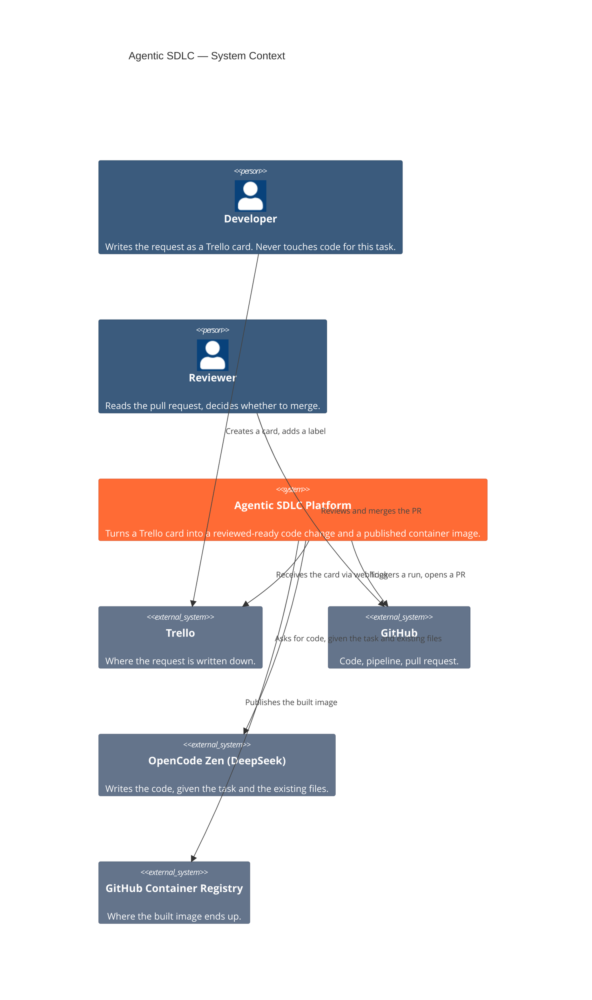
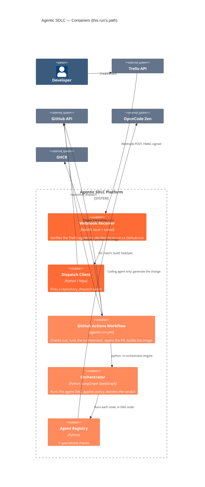
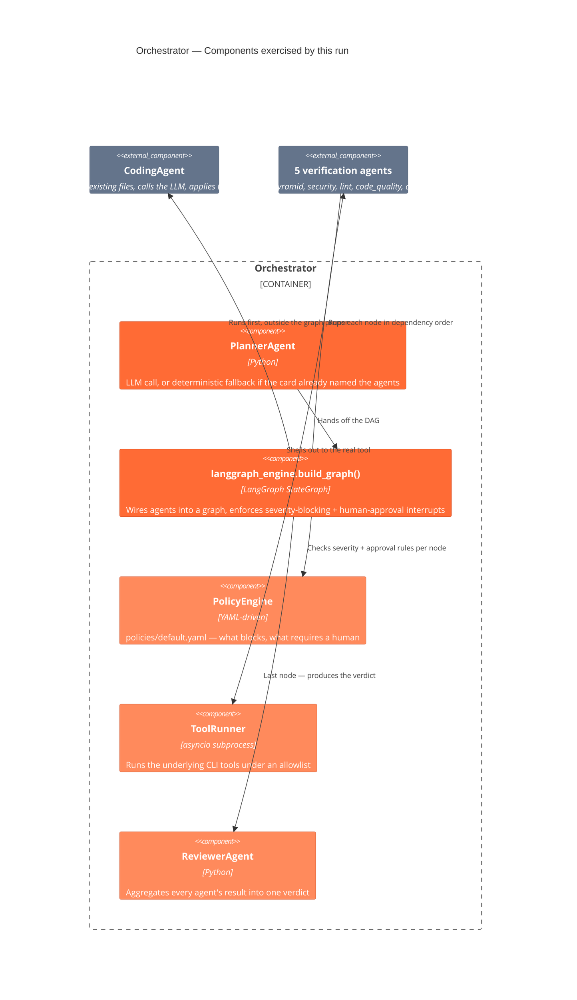
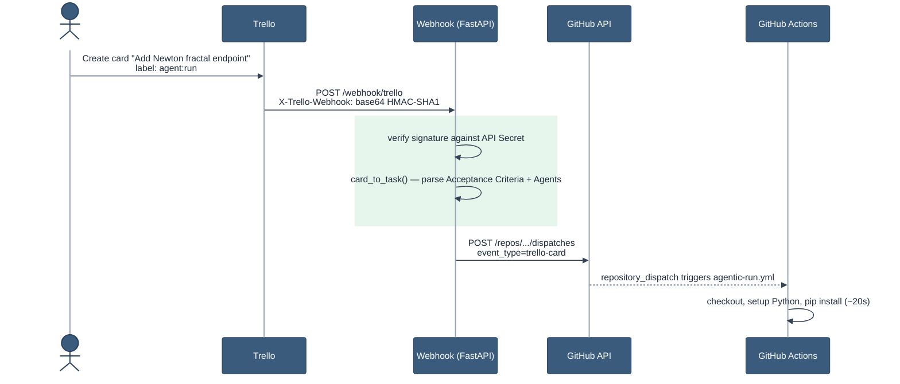
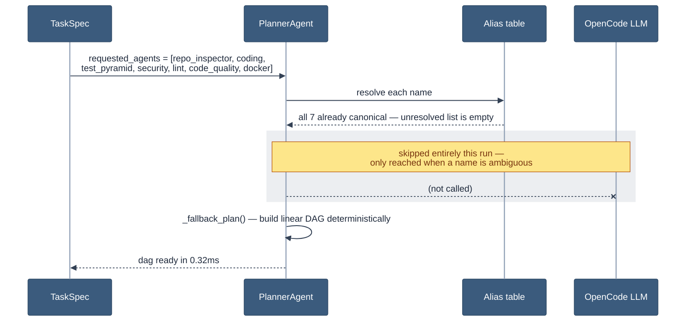
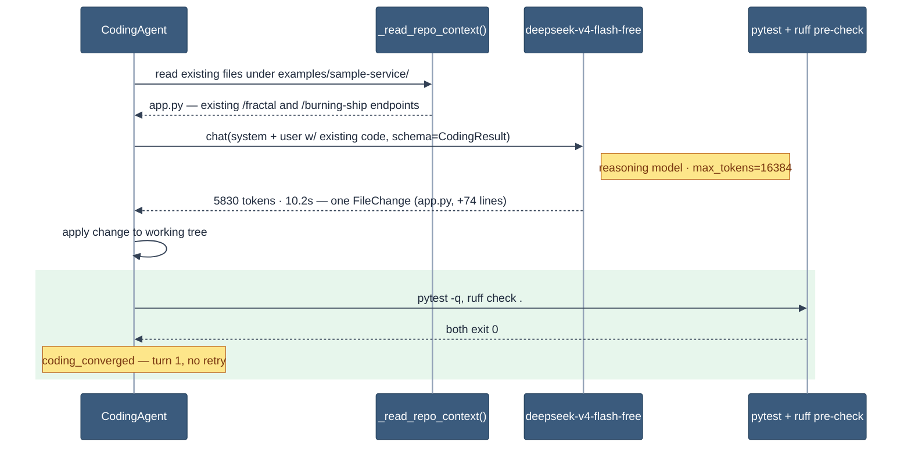
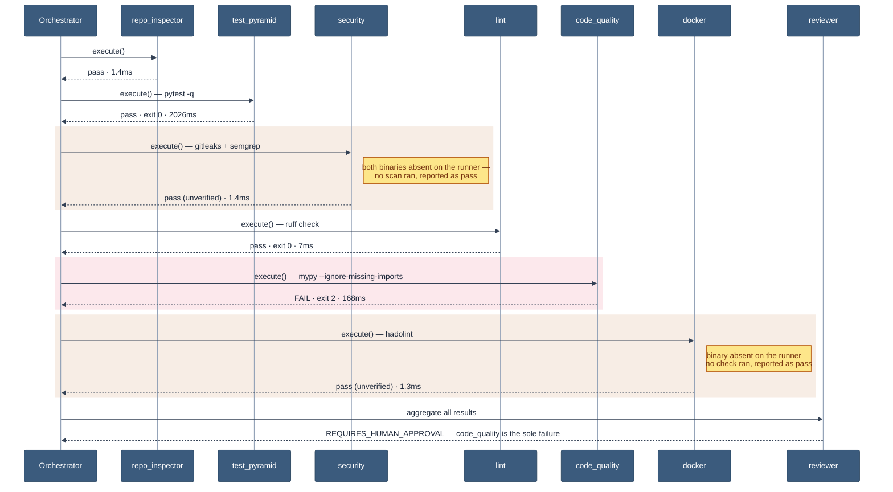
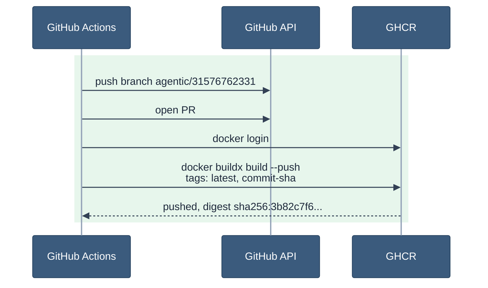

# Inside the Pipeline: the Newton Run

**Visual version (with UI reconstructions):** https://claude.ai/code/artifact/c8a12718-d3a0-414a-ba98-535cb81ff89d
**Date:** 2026-08-12
**Trello card:** https://trello.com/c/5PkJ8tE0
**GitHub Action run:** https://github.com/lorenzogirardi/agentic-sdlc/actions/runs/31576762331
**Pull request:** https://github.com/lorenzogirardi/agentic-sdlc/pull/14
**Image:** `ghcr.io/lorenzogirardi/agentic-sdlc-fractal:latest`

## Purpose

A second, clean demonstration run — same pipeline as
[the Burning Ship Run](./burning-ship-storytelling.md), no debugging this
time. The card asked for a Newton fractal endpoint (`GET /newton`) on the
sample service. The point of this run is architectural: which agents ran,
in what order, why the planner chose them, what each one actually produced,
and where the system drew the line and asked for a human — not how many
bugs got fixed along the way.

## How to read this document

1. **In plain language** — what happened, for a non-technical reader
2. **Architecture** — C4 Context, Container, and Component views
3. **The flow, step by step** — one sequence diagram per stage, in order
4. **Agent-by-agent output** — the real table
5. **Honest caveats**

---

## 1. In plain language

Someone wanted a new feature on a small demo service: a fractal-generating
endpoint. They wrote what they wanted on a Trello card, the way they'd write
a ticket for any teammate, and attached a label. Nobody touched a keyboard
again for this task.

A little over a minute later, there was a pull request waiting for review,
with working code that matched the existing app's style, and a container
image ready to deploy. Nothing was merged automatically — the system found
one code-quality issue on its own and, by policy, that alone was enough to
stop and ask a human to look before anything ships. That pause isn't a bug;
it's the point.

| | |
|---|---|
| **Speed** | A request becomes a reviewable pull request in about the time it takes to read this paragraph. |
| **Specialization** | Seven different checks — code, tests, security, style, types, container hygiene — run every time, not just when someone remembers to. |
| **Judgment, not autopilot** | The one thing that failed was enough to hold the release for a human. No policy in this system allows a silent override. |

**Headline numbers:**

| | |
|---|---|
| Wall clock, card → PR + image | ~68 seconds |
| Agents invoked | 7 (`repo_inspector`, `coding`, `test_pyramid`, `security`, `lint`, `code_quality`, `docker`) + `planner` + `reviewer` |
| LLM calls | 1 (coding agent, single turn, 5830 tokens, 10.2s) |
| Findings that gated auto-merge | 1 (`code_quality` / mypy, exit code 2) |
| Verdict | `REQUIRES_HUMAN_APPROVAL` |

---

## 2. Architecture

The C4 model describes a system at increasing detail: who uses it and what
it talks to (**Context**), the deployable pieces inside it (**Container**),
and the parts one of those pieces is built from (**Component**).

### Context


<sub>Blue = human actors · orange = the platform · grey = third-party systems</sub>

### Container


<sub>Blue = the developer · orange shades = platform containers · grey = third-party</sub>

### Component — inside the Orchestrator


<sub>Orange = the graph/policy core · grey = the agents it drives</sub>

---

## 3. The flow, step by step

### Step 1 — card to dispatch


<sub>Green band = the fix from the Burning Ship run holding up on a clean delivery</sub>

### Step 2 — how the agents get chosen

The planner only calls an LLM when it has to. This card's `## Agents`
section already named all seven agents in canonical form, so the planner
resolves them against a known alias table and builds the dependency graph
**deterministically** — no model call, no ambiguity, no cost.


<sub>Grey band = the path not taken this run</sub>

A vaguer card ("make it more secure") would route through the LLM instead;
this one didn't need to.

### Step 3 — the coding step, in detail


<sub>Green band = convergence on the first attempt</sub>

Same mechanism that failed three times on the Burning Ship run (Aug 11) —
this time it converged on the first attempt because the agent could see the
code it was extending.

### Step 4 — the verification DAG


<sub>Amber = unverified (tool missing) · red = the one real failure</sub>

**Execution order:** `repo_inspector → test_pyramid → security → lint →
code_quality → docker → reviewer`. (`coding` runs first, outside this DAG,
in its own converge-or-retry loop; `test_pyramid` and `lint` also fire once
as a fast pre-check right after coding, before the formal DAG shown above.)

### Step 5 — PR and image


<sub>Green band = the deliverable, published</sub>

---

## 4. Agent-by-agent output

| Agent | What it does | Result | Duration | Note |
|---|---|---|---|---|
| `planner` | Decides which agents run and in what order | pass | 0.32ms | Deterministic fallback — see Step 2 |
| `coding` | Writes the actual endpoint code | pass | 10.2s | 1 LLM turn, 5830 tokens, converged immediately |
| `repo_inspector` | Detects language, framework, test setup | pass | 1.4ms | — |
| `test_pyramid` | Runs the existing test suite | pass | 2.0s | `pytest -q`, exit 0 |
| `security` | Scans for secrets and vulnerable patterns | pass (**unverified**) | 1.4ms | gitleaks + semgrep not installed on this runner |
| `lint` | Style and formatting | pass | 7ms | `ruff check .`, exit 0 |
| `code_quality` | Static type checking | **fail** | 168ms | `mypy --ignore-missing-imports .`, exit code 2 — sole cause of the human-review gate |
| `docker` | Dockerfile hygiene | pass (**unverified**) | 1.3ms | hadolint not installed on this runner |
| `reviewer` | Aggregates everything into one verdict | ran | 0.15ms | `REQUIRES_HUMAN_APPROVAL` |

### The code

A hand-rolled Newton's-method solver for `f(z) = z³ − 1` — the classic
three-basin Newton fractal — added next to the existing `/fractal` and
`/burning-ship` endpoints, matching their response shape and clamping
conventions:

```python
@app.get("/newton")
async def newton(
    iterations: int = 5, width: int = 400, height: int = 300,
    xmin: float = -1.0, xmax: float = 1.0, ymin: float = -1.0, ymax: float = 1.0,
) -> JSONResponse:
    max_iter = max(1, min(iterations, 100))
    w = max(100, min(width, 800))
    h = max(75, min(height, 600))
    points = _newton_set(w, h, xmin, xmax, ymin, ymax, max_iter)
    return JSONResponse(content={"type": "newton", ...})
```

No new tests were added for the endpoint — the acceptance criteria required
existing tests to keep passing, but didn't explicitly ask for new coverage,
and the coding agent didn't volunteer any.

---

## 5. Honest caveats

1. **`security` and `docker` didn't really check anything this run** —
   their underlying tools (gitleaks, semgrep, hadolint) aren't installed on
   this GitHub Actions runner. A missing binary is currently treated as "no
   findings" rather than "couldn't verify." Worth fixing (install the tools
   in the workflow, or fail loudly when a scanner binary is absent) before
   relying on those two gates for anything real.
2. **No test coverage for the new endpoint.**
3. **mypy's actual error text isn't captured in the structured logs** —
   only its exit code. A reviewer would need to run mypy locally to see
   what it flagged.

## Reconstructed screens

No browser was available in this session to capture real screenshots of
Trello or GitHub. The [visual version](https://claude.ai/code/artifact/c8a12718-d3a0-414a-ba98-535cb81ff89d)
includes UI reconstructions built from the real API data shown here (card
content, run step timings, PR file stats, image tags) — explicitly labeled
as reconstructions, not screenshots.
