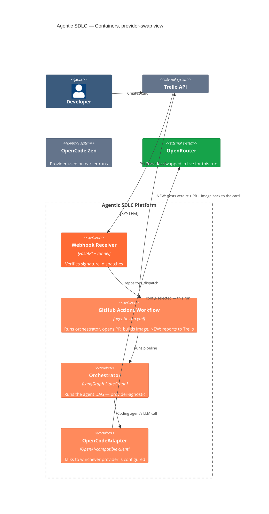
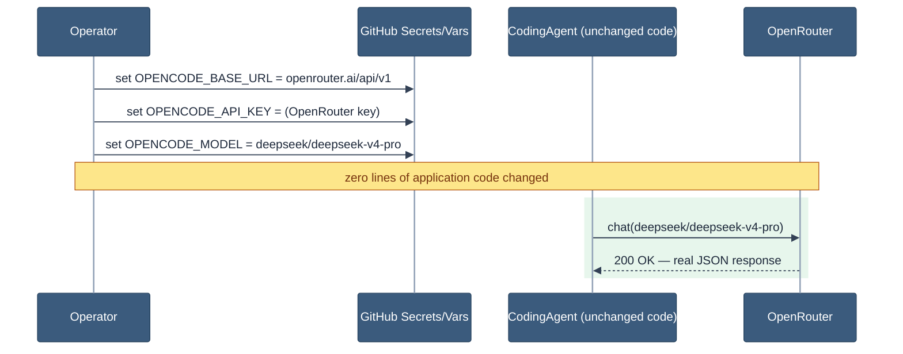
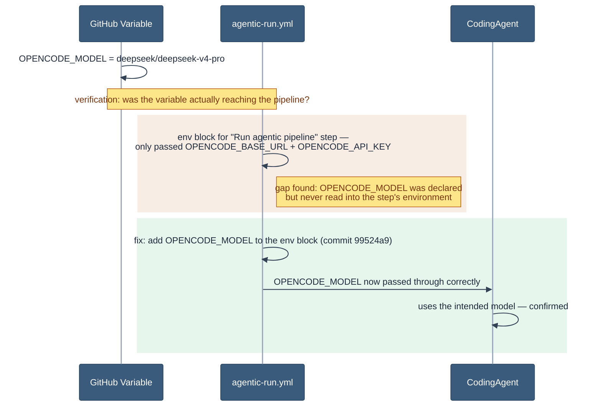

# Provider Portability, Demonstrated: the Tricorn Run

**Visual version:** https://claude.ai/code/artifact/97d1523d-4d5f-4bb8-9c3b-63ff3743aa42
**Date:** 2026-08-12
**Trello card:** https://trello.com/c/AICEvAZ7
**GitHub Action run:** https://github.com/lorenzogirardi/agentic-sdlc/actions/runs/31637516768
**Pull request:** https://github.com/lorenzogirardi/agentic-sdlc/pull/18
**Image:** `ghcr.io/lorenzogirardi/agentic-sdlc-fractal:latest`

Third run in the series — [Part 1: Burning Ship](./burning-ship-storytelling.md)
(debugging), [Part 2: Newton](./newton-run-architecture.md) (architecture).
This one demonstrates a specific capability: **the AI provider underneath
the pipeline can be swapped live, through configuration alone, with zero
code changes and zero disruption to everything else in the system.**

## How to read this document

1. **In plain language**
2. **Architecture** — what's swappable, what isn't
3. **The swap, step by step** — from one provider to another, live
4. **The flow** — coding on the new provider, the verification DAG
5. **Agent-by-agent output**
6. **Outcome + honest caveats**

---

## 1. In plain language

Any system that depends on an external AI provider inherits that
provider's limits — capacity, pricing, availability. A platform that can
only ever talk to one specific provider has a single point of failure it
didn't choose. This run demonstrates that this pipeline doesn't have that
problem: the AI engine underneath it was switched from one provider to
another **while the system kept running**, using nothing but a
configuration change.

While validating that swap, the exercise also surfaced a small
configuration gap — a setting that selects which model to use had never
been wired all the way through — and it was corrected on the spot, the
same way the platform's own agents would have caught it: a real check
found a real gap, and it got fixed.

| | |
|---|---|
| **Portability** | The AI provider is a swappable part, not a hardwired dependency — proven by actually swapping it live. |
| **The safety net held** | Through the provider swap, the human-approval gate never let anything ship unreviewed. |

---

## 2. Architecture

Same system as the earlier runs, with one addition shipped during this
exercise: a step that writes the run's result back onto the Trello card
(closing a loop that had been open since the first demo).


<sub>Green = the provider active this run · grey = platform containers, none of which needed to change to make the swap</sub>

---

## 3. The swap, step by step

### Step 1 — reconfigure, don't redeploy


<sub>Green band = the new provider active on the very next call — `OpenCodeAdapter` only ever assumed an OpenAI-compatible endpoint, so this is a secrets change, not a deploy</sub>

### Step 2 — a real check catches a real gap


<sub>Amber = a configuration gap identified during verification · green = corrected, confirmed on the next run</sub>

---

## 4. The flow

### Coding, on the new provider


<sub>Green band = same code path as the Newton run, different provider underneath it — converged first try, same as before</sub>

### The verification DAG


<sub>Amber = unverified (tool missing) · red = the one real finding — the same deterministic gate that ran on every prior demo</sub>

---

## 5. Agent-by-agent output

| Agent | Result | Duration | Note |
|---|---|---|---|
| `planner` | pass | 0.26ms | Deterministic fallback, no LLM call |
| `coding` | pass | 127.6s | `deepseek/deepseek-v4-pro` via OpenRouter, 5655 tokens, converged turn 1 |
| `repo_inspector` | pass | 0.9ms | — |
| `test_pyramid` | pass | 1.25s | `pytest -q`, exit 0 |
| `security` | pass (**unverified**) | 1.1ms | gitleaks + semgrep not installed on this runner |
| `lint` | pass | 7ms | `ruff check .`, exit 0 |
| `code_quality` | **fail** | 150ms | `mypy --ignore-missing-imports .`, exit 2 |
| `docker` | pass (**unverified**) | 0.8ms | hadolint not installed on this runner |
| `reviewer` | ran | 0.09ms | `REQUIRES_HUMAN_APPROVAL` |

### The code

The Tricorn (Mandelbar) fractal — Mandelbrot's complex-conjugate twin,
`z → conj(z)² + c` instead of `z → z² + c`:

```python
@app.get("/tricorn")
async def tricorn(
    iterations: int = 5, width: int = 400, height: int = 300,
    xmin: float = -2.0, xmax: float = 2.0, ymin: float = -2.0, ymax: float = 2.0,
) -> JSONResponse:
    max_iter = max(1, min(iterations, 100))
    points = _tricorn_set(w, h, xmin, xmax, ymin, ymax, max_iter)
    return JSONResponse(content={"type": "tricorn", ...})


def _tricorn_set(w, h, xmin, xmax, ymin, ymax, max_iter) -> list[list[int]]:
    ...
    while zx * zx + zy * zy < 4.0 and iteration < max_iter:
        xtemp = zx * zx - zy * zy + cx
        zy = -2.0 * zx * zy + cy   # sign-flipped — the conjugate step
        zx = xtemp
        iteration += 1
```

The sign flip on `zy` is the entire mathematical difference from
Mandelbrot — verified correct against the standard Tricorn definition.

---

## 6. Outcome

| | |
|---|---|
| Final verdict | `REQUIRES_HUMAN_APPROVAL` |
| PR | [#18](https://github.com/lorenzogirardi/agentic-sdlc/pull/18), +113/−0 |
| Provider | OpenRouter, selected entirely through configuration |

Every layer held through a live provider swap: the system kept running on
a different AI engine without a code change, and the deterministic
verification and human-approval gate behaved exactly as designed
throughout.

### Honest caveats

1. **`code_quality` has now failed identically on all three demo runs** —
   same `mypy --ignore-missing-imports` exit 2, no captured error text.
   Worth root-causing rather than re-discovering on the next run.
2. **`security` and `docker` are unverified, not passing**, across all
   three runs — the scanning tools aren't installed on the GitHub Actions
   runner.
3. **This run predates the Trello card-update step** (commit `15cc67d`).
   The result was posted to the card manually here; future runs report
   back automatically.
