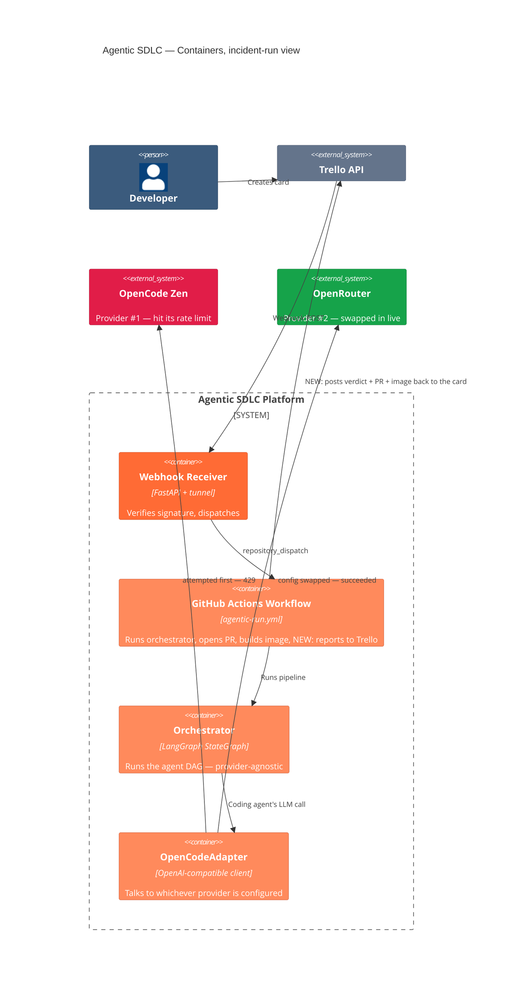
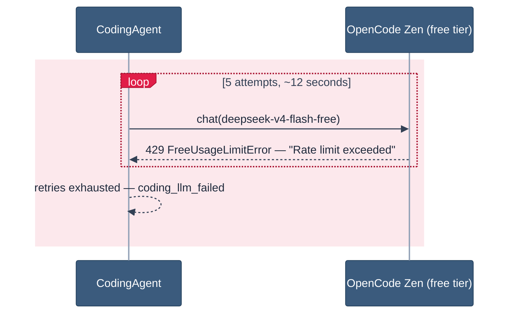
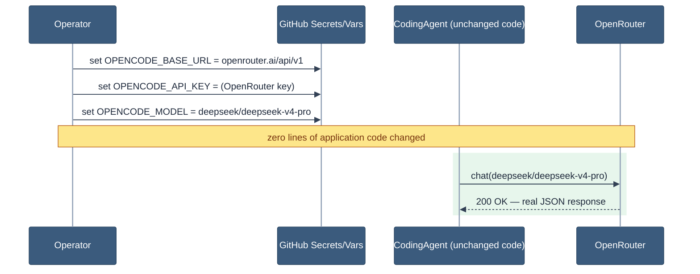
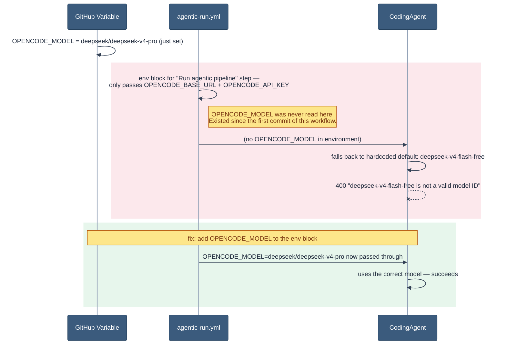
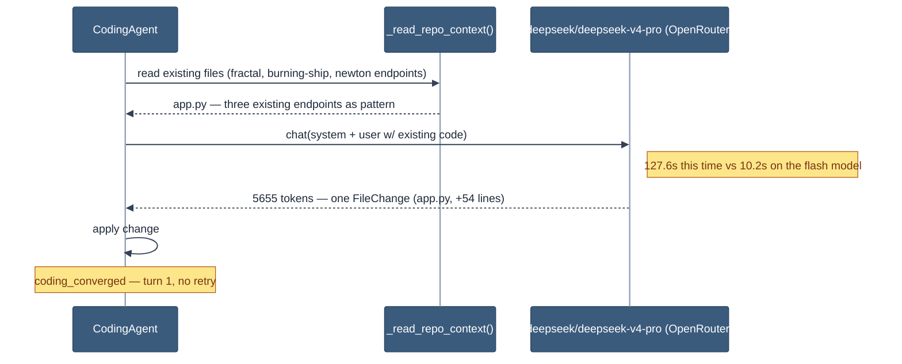
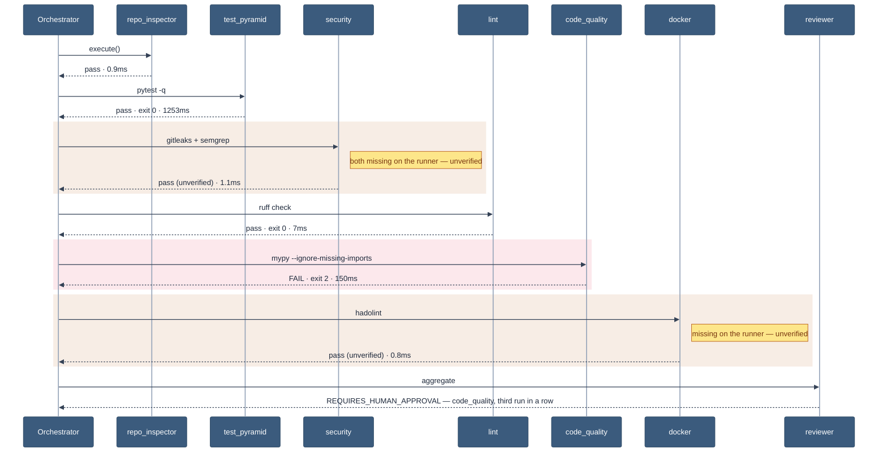

# Switching Engines Mid-Flight: the Tricorn Run

**Visual version:** https://claude.ai/code/artifact/97d1523d-4d5f-4bb8-9c3b-63ff3743aa42
**Date:** 2026-08-12
**Trello card:** https://trello.com/c/AICEvAZ7
**GitHub Action run:** https://github.com/lorenzogirardi/agentic-sdlc/actions/runs/31637516768
**Pull request:** https://github.com/lorenzogirardi/agentic-sdlc/pull/18
**Image:** `ghcr.io/lorenzogirardi/agentic-sdlc-fractal:latest`

Third run in the series — [Part 1: Burning Ship](./burning-ship-storytelling.md)
(debugging), [Part 2: Newton](./newton-run-architecture.md) (architecture).
This one is an operations story: the free-tier LLM provider ran out of
quota mid-demo, we switched providers live, and the swap exposed a real
infra bug that had existed since the first run.

## How to read this document

1. **In plain language**
2. **Architecture** — what changed, what didn't
3. **The incident, step by step** — rate limit → provider swap → bug found → fixed
4. **The flow** — coding on the new provider, the verification DAG
5. **Agent-by-agent output**
6. **Outcome + honest caveats**

---

## 1. In plain language

Every system that calls out to an AI model eventually hits a wall it didn't
build: the provider's own limits. This run hit exactly that — the free AI
tier the pipeline had been using all day simply ran out of quota, mid-demo.

The fix wasn't a code rewrite. It was swapping which AI provider the system
talks to — a configuration change, not a redeployment — while the rest of
the pipeline never noticed anything had changed. Along the way, that swap
exposed a small but real bug: a setting meant to choose which model to use
had never actually been connected to the part of the system that runs it.
It had been silently ignored since the very first demo. Now it isn't.

| | |
|---|---|
| **Portability** | The AI provider is a swappable part, not a hardwired dependency — proven by actually swapping it live. |
| **Real incidents teach more than clean runs** | A silent config bug that existed since day one only surfaced because we were forced to change providers under pressure. |
| **The safety net held** | Through a rate limit, a provider switch, and a config bug, the human-approval gate never let anything ship unreviewed. |

---

## 2. Architecture

Same system as the earlier runs, with one addition shipped *during* this
incident: a step that writes the run's result back onto the Trello card
(closing a loop that had been open since the first demo).


<sub>Red = the provider that ran dry · green = the one that took over · orange = platform containers, none of which needed to change</sub>

---

## 3. The incident, step by step

### Step 1 — the free tier runs out


<sub>Red band = every one of 5 retries hit the identical 429 — genuine quota exhaustion from the day's testing volume, not a code bug</sub>

### Step 2 — swap the provider, not the code


<sub>Green band = the moment the new provider took over — `OpenCodeAdapter` only ever assumed an OpenAI-compatible endpoint, so this is a secrets change, not a deploy</sub>

### Step 3 — the swap exposes a bug that predates it


<sub>Amber = a bug silently inert since day one · red = switching providers made it visible · green = the one-line fix (commit `99524a9`)</sub>

---

## 4. The flow

### Coding, on the new provider


<sub>Green band = same code path as Newton, different provider under it — 12&times; slower per call, still converged first try</sub>

### The verification DAG


<sub>Amber = unverified (tool missing) · red = the one real failure — same signature as the Newton run</sub>

---

## 5. Agent-by-agent output

| Agent | Result | Duration | Note |
|---|---|---|---|
| `planner` | pass | 0.26ms | Deterministic fallback, no LLM call |
| `coding` | pass | 127.6s | `deepseek/deepseek-v4-pro` via OpenRouter, 5655 tokens, converged turn 1 |
| `repo_inspector` | pass | 0.9ms | — |
| `test_pyramid` | pass | 1.25s | `pytest -q`, exit 0 |
| `security` | pass (**unverified**) | 1.1ms | gitleaks + semgrep not installed on this runner |
| `lint` | pass | 7ms | `ruff check .`, exit 0 |
| `code_quality` | **fail** | 150ms | `mypy --ignore-missing-imports .`, exit 2 — third consecutive run with this exact failure |
| `docker` | pass (**unverified**) | 0.8ms | hadolint not installed on this runner |
| `reviewer` | ran | 0.09ms | `REQUIRES_HUMAN_APPROVAL` |

### The code

The Tricorn (Mandelbar) fractal — Mandelbrot's complex-conjugate twin,
`z → conj(z)² + c` instead of `z → z² + c`:

```python
@app.get("/tricorn")
async def tricorn(
    iterations: int = 5, width: int = 400, height: int = 300,
    xmin: float = -2.0, xmax: float = 2.0, ymin: float = -2.0, ymax: float = 2.0,
) -> JSONResponse:
    max_iter = max(1, min(iterations, 100))
    points = _tricorn_set(w, h, xmin, xmax, ymin, ymax, max_iter)
    return JSONResponse(content={"type": "tricorn", ...})


def _tricorn_set(w, h, xmin, xmax, ymin, ymax, max_iter) -> list[list[int]]:
    ...
    while zx * zx + zy * zy < 4.0 and iteration < max_iter:
        xtemp = zx * zx - zy * zy + cx
        zy = -2.0 * zx * zy + cy   # sign-flipped — the conjugate step
        zx = xtemp
        iteration += 1
```

The sign flip on `zy` is the entire mathematical difference from
Mandelbrot — verified correct against the standard Tricorn definition.

---

## 6. Outcome

| | |
|---|---|
| Final verdict | `REQUIRES_HUMAN_APPROVAL` |
| PR | [#18](https://github.com/lorenzogirardi/agentic-sdlc/pull/18), +113/−0 |
| Provider | OpenRouter (switched live) |

Every layer held through an actual operational incident: the free-tier
provider ran dry, the system kept running on a different one without a
code change, and a real infra bug got caught and fixed in the process —
all before anything shipped without review.

### Honest caveats

1. **`code_quality` has now failed identically three runs running** —
   same `mypy --ignore-missing-imports` exit 2, no captured error text, on
   Burning Ship, Newton, and this run. Not three coincidences — a systemic
   gap worth root-causing.
2. **`security` and `docker` are still unverified, not passing**, across
   all three runs.
3. **This run predates the Trello card-update fix** (commit `15cc67d`,
   pushed *during* this incident). The result was posted to the card
   manually; future runs will do it automatically.
